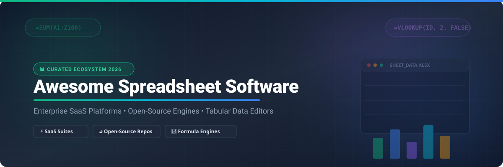

# 📊 Awesome Spreadsheet Software

p    

## 🚀 Top Spreadsheet Software & Calculation Engine Ecosystem

> **A comprehensive, SEO-optimized, curated directory of enterprise SaaS spreadsheet platforms, open-source calculation engines, headless formula parsers, and web-embeddable tabular data suites.**

*Focused on Data Analysis, Real-time Collaborative Sheets, No-Code Databases, and High-Performance Calculation Libraries.*  
**Last updated: October 2026**

---

## 📌 Table of Contents

- [📊 SaaS & Hosted Spreadsheet Platforms](#-saas--hosted-spreadsheet-platforms)
- [🔓 Open-Source GitHub Repositories](#-open-source-github-repositories)
- [🏗️ Frameworks & Architecture Recommendations](#%EF%B8%8F-frameworks--architecture-recommendations)
- [🤝 How to Contribute](#-how-to-contribute)
- [⚠️ Disclaimer & Technical Nuances](#%EF%B8%8F-disclaimer--technical-nuances)
- [⭐ Star History](#-star-history)
- [💖 Support & Community](#-support--community)

---

## 📊 SaaS & Hosted Spreadsheet Platforms

📈 **Market Size & Structure Overview**: The global spreadsheet and office productivity software market is estimated at **$25 – $30 Billion USD (2026)**. The sector is **highly concentrated** (dominated by Microsoft Excel & Google Workspace holding over 85% market share), while specialized database-spreadsheet hybrid niches (like Airtable, Smartsheet, and Zoho Sheet) exhibit **moderate fragmentation** targeting customized business workflow automations.

Below is the comparative breakdown of leading commercial spreadsheet platforms sorted by **Company Valuation / Revenue Size (Descending)**:

| Product Name | Company Valuation / Revenue Size | Starting Tier Price | Free Tier / Trial Limit | Target Use Case & Key Features |
| :--- | :--- | :--- | :--- | :--- |
| 🌐 **[Apple Numbers](https://www.apple.com/numbers/)** | **~$3.4 Trillion** *(Apple Inc.)* | **Included Free** with Apple Hardware | **Free Forever** for all Apple ID holders (5 GB iCloud storage limit) | **macOS / iOS Native Canvas**: Freeform layout canvas, fluid interactive charts, elegant templates, and native iCloud sync. |
| 🏢 **[Microsoft Excel](https://www.microsoft.com/microsoft-365/excel)** | **~$3.1 Trillion** *(Microsoft Corp.)* | **$6.00 / user / mo** *(MS 365 Business Basic)* | **Free Web Version** *(Excel for Web)* with free Microsoft account (5 GB OneDrive limit) | **Enterprise Industry Standard**: Pivot tables, Power Query ETL, VBA macros, Power Pivot, dynamic arrays, and Copilot AI. |
| ⚡ **[Google Sheets](https://sheets.google.com/)** | **~$2.1 Trillion** *(Alphabet Inc.)* | **$6.00 / user / mo** *(Google Workspace Starter)* | **Free Forever** (15 GB Google Drive storage per free Google account) | **De Facto Collaborative Sheet**: Instant real-time co-editing, version history, Google Apps Script, smart chips, and web integration. |
| 💼 **[Quip Spreadsheets](https://quip.com/)** | **~$300 Billion** *(Salesforce, Inc.)* | **$10.00 / user / mo** *(Quip Starter)* | **30-Day Free Trial** (Up to 5 users, full feature access during trial) | **Salesforce CRM Integration**: Embedded live spreadsheet tables within Salesforce records, sales forecasting, and team docs. |
| 🖥️ **[WPS Spreadsheet](https://www.wps.com/)** | **~$15 Billion** *(Kingsoft Office)* | **$29.99 / year** *(WPS Office Pro)* | **Free Forever** (Ad-supported desktop suite with core XLSX editing & templates) | **High XLSX Compatibility**: Desktop ribbon interface, lightweight memory footprint, tabbed editing, and cost-effective enterprise licensing. |
| 🗃️ **[Airtable](https://airtable.com/)** | **~$11.7 Billion** *(Formagrid, Inc.)* | **$20.00 / user / mo** *(Team plan, billed annually)* | **Free Forever** (1,000 records/base, 1 GB attachments/base, up to 5 creators) | **No-Code Database Hybrid**: Relational table linking, Kanban / Grid / Calendar views, automated triggers, and REST API generation. |
| 📊 **[Smartsheet](https://www.smartsheet.com/)** | **~$8.4 Billion** *(Acquired by Blackstone/Vista)* | **$7.00 / user / mo** *(Pro plan, billed annually)* | **Free Forever** (1 user, up to 2 sheets, 500 MB attachments) or **30-Day Trial** | **Enterprise Work Management**: Project portfolio tracking, Gantt charts, automated request approvals, and resource management. |
| ☁️ **[Zoho Sheet](https://www.zoho.com/sheet/)** | **~$1.2 Billion** *(Zoho Corp Annual Revenue)* | **$3.00 / user / mo** *(Zoho Workplace Standard)* | **Free Forever** (Up to 5 users, 5 GB cloud storage per user) | **Zoho Ecosystem & AI**: Zia AI data cleaning, custom Deluge script automation, pivot tables, and collaborative web editing. |

---

## 🔓 Open-Source GitHub Repositories

Below are prominent open-source spreadsheet applications, database hybrids, headless formula engines, and web UI components sorted by **GitHub Star Count (Descending)**. Star badges directly link to each repository's stargazers page.

| Repository / Project | GitHub Stars | License | Core Category | Architecture & Key Features |
| :--- | :--- | :--- | :--- | :--- |
| 🚀 **[NocoDB](https://github.com/nocodb/nocodb)** |  | AGPL-3.0 | Database Hybrid | **Turn SQL into Spreadsheet**: Connects PostgreSQL, MySQL, SQLite, and SQL Server into smart collaborative tables with REST APIs. |
| 📦 **[SheetJS / xlsx](https://github.com/SheetJS/sheetjs)** |  | Apache-2.0 | Data Engine | **High-Performance Parser**: De facto JavaScript spreadsheet library for parsing, exporting, and manipulating XLS/XLSX/CSV data. |
| 🧮 **[Excelize](https://github.com/qax-os/excelize)** |  | BSD-3-Clause | Go Library | **Pure Go Excel Parser**: High-speed Go library for reading and writing Microsoft Excel (XLAM / XLSM / XLSX / XLTM / XLTX) files. |
| 🎨 **[Luckysheet](https://github.com/dream-num/Luckysheet)** |  | MIT | Web Component | **Browser Spreadsheet Component**: Excel-like web UI with formulas, conditional formatting, pivot tables, and chart rendering. |
| 📑 **[x-spreadsheet](https://github.com/matsu-s/x-data-spreadsheet)** |  | MIT | Web Component | **Lightweight Canvas Grid**: Zero-dependency JavaScript canvas spreadsheet engine for fast web embedding and custom grid apps. |
| ⚡ **[Teable](https://github.com/teablio/teable)** |  | AGPL-3.0 | Database Hybrid | **Real-Time Postgres Database**: Super-fast no-code database built on PostgreSQL and modern web assembly for ultra-large datasets. |
| 🌐 **[APITable](https://github.com/apitable/apitable)** |  | AGPL-3.0 | Database Hybrid | **API-First Visual Database**: Open-source Airtable alternative with real-time collaboration, auto-generated REST APIs, and SDKs. |
| 💻 **[Univer](https://github.com/dream-num/univer)** |  | Apache-2.0 | Embeddable SDK | **Full-Stack Spreadsheet SDK**: Enterprise-grade framework for building web spreadsheets, documents, and slides with formulas and canvas UI. |
| 🐍 **[Grist](https://github.com/gristlabs/grist-core)** |  | Apache-2.0 | Database Hybrid | **Python-Powered Spreadsheet**: Relational database hybrid with full Python formulas, custom dashboard layouts, and access control. |
| 🧩 **[Baserow](https://github.com/bunkum/baserow)** |  | MIT | Database Hybrid | **No-Code Database Platform**: Modular database builder created with Django and NuxtJS, self-hostable alternative to Airtable. |
| 📐 **[Quadratic](https://github.com/quadratichq/quadratic)** |  | MIT | Infinite Canvas | **Code-First Infinite Grid**: Spreadsheet combining Python, SQL, and formulas into an infinite web-GL canvas for data science teams. |
| ⚙️ **[formulajs](https://github.com/formulajs/formulajs)** |  | MIT | Formula Engine | **JavaScript Excel Functions**: Pure JS library implementing 100+ standard Microsoft Excel calculation formulas for web apps. |
| 🛡️ **[OnlyOffice Spreadsheet](https://github.com/ONLYOFFICE/DocumentServer)** |  | AGPL-3.0 | Office Server | **Native OOXML Collaboration**: Highest Excel format fidelity among open-source suites with real-time co-editing and Nextcloud integration. |
| 🧮 **[HyperFormula](https://github.com/handsontable/hyperformula)** |  | GPL-3.0 | Headless Engine | **400+ Excel Function Engine**: Headless spreadsheet formula engine supporting cross-sheet references, matrix math, and CRUD operations. |
| 🖥️ **[LibreOffice Calc](https://github.com/LibreOffice/core)** |  | MPL-2.0 | Desktop App | **De Facto Open Desktop Suite**: Mature C++ spreadsheet with full ODF/XLSX support, Goal Seek, Solver, pivot tables, and Python/Basic macros. |
| 🌐 **[EtherCalc](https://github.com/audreyt/ethercalc)** |  | CPAL-1.0 | Web Server | **Real-Time Collaborative Server**: Web-based multiplayer spreadsheet server powered by Node.js and Redis (derived from SocialCalc). |
| ⚛️ **[FortuneSheet](https://github.com/ruilisi/fortune-sheet)** |  | MIT | React Component | **React Spreadsheet Grid**: Modernized React component based on Luckysheet code, designed for easy React framework embedding. |
| 🌳 **[TreeSheets](https://github.com/jaap-karssenberg/treesheets)** |  | Zlib | Desktop App | **Hierarchical Matrix Editor**: Unique grid-within-grid spreadsheet replacement designed for complex nested data, mind mapping, and planning. |
| 📝 **[CSV Editor](https://github.com/bpigato/csv-editor)** |  | MIT | Desktop App | **Svelte + Tauri CSV Tool**: Fast cross-platform desktop application for viewing, filtering, and editing large CSV files safely. |
| 🦀 **[Rusty Spreadsheet](https://github.com/ricky26/rusty-spreadsheet)** |  | MIT | Rust Engine | **Rust Calculation Architecture**: Open-source educational spreadsheet engine written in Rust focusing on cell dependency graph evaluation. |
| 🔍 **[CSVFileView](https://github.com/desperado/csvfileview)** |  | GPL-3.0 | Desktop Viewer | **Ultra-Fast C++ Viewer**: Windows desktop binary for viewing and filtering multi-gigabyte CSV data files without heavy RAM usage. |

---

## 🏗️ Frameworks & Architecture Recommendations

When architecting a spreadsheet application, select components based on your target integration stack:

1. **Desktop Native & Workstation Editing**: Use **LibreOffice Calc** for full-featured desktop editing with offline macro support, or **OnlyOffice Spreadsheet** for native OOXML compatibility.
2. **Browser-Embedded Spreadsheets**: Integrate **Univer** (modern TypeScript SDK) or **FortuneSheet** / **Luckysheet** (React/JS web components).
3. **Headless Calculation Engines**: Deploy **HyperFormula** (400+ Excel functions in Node.js/Browser) or **formulajs** for lightweight formula evaluation without UI overhead.
4. **No-Code Database Hybrids**: Self-host **NocoDB**, **Grist**, **Teable**, or **Baserow** for relational record management with spreadsheet grid views.
5. **High-Volume CSV Processing**: Use **SheetJS** (JavaScript) or **Excelize** (Go) for automated file parsing and backend sheet generation.

---

## 🤝 How to Contribute

Contributions are warmly welcome! Help us keep this spreadsheet software ecosystem up-to-date and comprehensive.

1. 🍴 **Fork the repository**.
2. 📝 **Add or update entries** in `README.md` maintaining table formats and verified pricing/star data.
3. 📌 **Include**: Product name, official link, star count badge, license, starting price/free limit, and 1–2 sentence description.
4. 🚀 **Submit a Pull Request** with a brief note explaining the change.

---

## ⚠️ Disclaimer & Technical Nuances

- This directory is **community-curated** for educational, comparison, and research purposes.
- **Security Note**: Spreadsheet software handles sensitive financial and personal datasets. Self-hosted database engines require security hardening, SSL encryption, and proper backup protocols.
- **Format Compatibility**: LibreOffice Calc and OnlyOffice offer strong XLSX compatibility, but complex proprietary Excel features (VBA macros, Power Query ETL pipelines, dynamic array formulas) may require manual audit.
- **Headless Formula Engine Scope**: Libraries like **HyperFormula** and **formulajs** compute formula trees but do not provide UI rendering or file format serialization natively.

---

## ⭐ Star History

---

## 💖 Support & Community

Thank you for exploring **Awesome Spreadsheet Software**! If this repository has helped you discover spreadsheet tools, calculation engines, or dataset tools:

- ⭐ **Star this repository** to help others discover it!
- 🍴 **Fork the repo** to add your own tools or contribute updates.
- 📢 **Share it** with your colleagues, dev team, and social channels.
- ☕ **Buy me a coffee**: Support ongoing open-source maintenance via the [GitHub Sponsor Dashboard](https://github.com/sponsors/ishandutta2007).

---

Made with ❤️ for analysts, software engineers, and data professionals seeking spreadsheet sovereignty.

